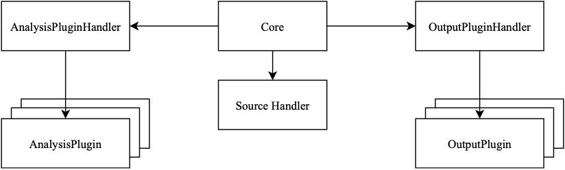

# Clean Code Analysis Platform

This repository contains the CCAP of the thesis "Automated Checking of Clean Code Guidelines for Python".

## Setup and Run
### One-Click Setup
The CCAP can be installed as a regular python package. Tested on Linux and Mac, but it should work on Windows too.

1. Clone the repository and cd into it
2. install the package with (I recommend using a virtual environment)
```
pip install .
```
3. Run it on a sepcific directory
```
ccap test_programs
```
### Custom analysis or output plugins
Run ccap with a custom folder for analysis and output plugins. Use the absolut path for this!
```
ccap --analysisPluginDir $(pwd)/plugins  --outputPluginDir $(pwd)/output_plugins  --output std2 test_programs
```

Alternatively, you can also place the plugins in the project folder and reinstall the python package with the command under 2.


### Integrated Output Plugins
We include a default plugin for a formated output to the command-line (std) and a report generation in html format (html).

## Software Architecture
For a detailed overview of the architecture, please read chapter 3.1 Clean Code Analysis Platform in the thesis.

The system is design with exensibility, useability and integration possibilities in mind. It can be expanded with analysis and output plugins. The following provides a schematic overview of the architecture.



### Plugins
The Plugin definitions are placed in the ``plugin_definition`` folder. The bundled plugins are in the ``analysis_plugins`` and ``output_plugins`` folder. 

#### Own Plugins
For creating your own plugins, please consult the explanation in the thesis (3.1.2 Analysis Plugins) or study the simple example in the ``analysis_plugins/return_none_plugin.py `` file.

The following step-by-step recipe is extracted from the thesis:
1. Create a .py file with a class inheriting from AbstractAnalysisPlugin.
2. Instanziate PluginMetaData and assign it to the metadata member.
3. Define a problem class inheriting from AbstractAnalysisProblem and set the problem name and description following the guidelines above.
4. Implement the do_analysis method with a ParsedSourceFile parameter. Return an AnalysisReport instance with all found problems.
5. Place the .py file into the analysis plugin directory of the tool.

## Tests
I suggest you to write tests to ensure correct functionality. The preexisting analysis plugins already contain tests, please use those as a reference.

To run the tests, run the following in the root project folder:
```
pytest ccap/**/*.py
```

## Type checking
You can run mypy with the follwing command (after installing it with ``pip install mypy``)
```
mypy **/*.py  --namespace-packages
```
It will report three errors (one in setup.py and two the plugin_loader.py). The problems are missing type information of the library used. I was not able to solve these errors, but they will not impact the runtime.

## CI Pipeline
This project contains a continous integration pipeline with GitHub Actions. The Actions will all tests on every push.